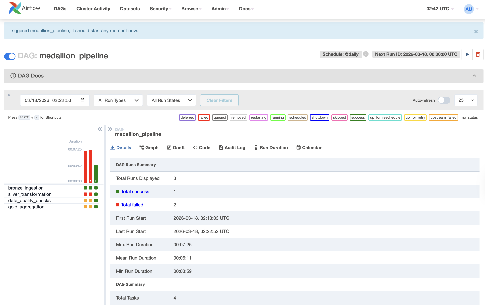

# Medallion Pipeline

End-to-end batch data pipeline using the **Medallion Architecture** pattern, processing NYC Yellow Taxi trip data through Bronze → Silver → Gold layers — fully orchestrated with Apache Airflow and running locally via Docker.


---

## Architecture

```
Raw Data (Parquet)
    │
    ▼
┌─────────────────────────────────────────────┐
│  Bronze Layer — Raw ingestion, append-only   │
│  • File-level tracking (skip already seen)   │
│  • Schema standardization across months      │
│  • Metadata: timestamp, source file, batch   │
└─────────────────────┬───────────────────────┘
                      │
                      ▼
┌─────────────────────────────────────────────┐
│  Silver Layer — Cleaned and conformed        │
│  • Deduplication on composite key            │
│  • Explicit type casting (Decimal for money) │
│  • Invalid records → quarantine table        │
│  • Snake_case column standardization         │
└─────────────────────┬───────────────────────┘
                      │
                      ▼
┌─────────────────────────────────────────────┐
│  Data Quality Checks — Pass/fail gate        │
│  • Null checks, duplicate checks             │
│  • Row count validation, schema checks       │
│  • Negative value detection                  │
└─────────────────────┬───────────────────────┘
                      │
                      ▼
┌─────────────────────────────────────────────┐
│  Gold Layer — Business-ready aggregations    │
│  • daily_summary — trips, revenue per day    │
│  • location_summary — top zones ranked       │
│  • monthly_trends — MoM growth via lag()     │
│  • payment_type_summary — cash vs card split │
└─────────────────────────────────────────────┘

Orchestrated by Apache Airflow (@daily schedule)
```



---

## Tech Stack

| Tool | Purpose |
|------|---------|
| **PySpark** | Distributed data processing |
| **Delta Lake** | ACID-compliant lakehouse storage with time travel |
| **Apache Airflow** | Workflow orchestration and scheduling |
| **Docker Compose** | Containerized multi-service local environment |
| **Python** | Scripting, data quality checks, utilities |

---

## Project Structure

```
medallion-pipeline/
├── docker-compose.yml          # Airflow + Postgres services
├── Dockerfile                  # Custom image: Airflow + Java + PySpark + Delta
├── requirements.txt            # Python dependencies
├── dags/
│   └── medallion_pipeline_dag.py   # Airflow DAG definition
├── scripts/
│   ├── bronze_ingestion.py         # Raw ingestion with file tracking
│   ├── silver_transformation.py    # Cleaning, dedup, type casting
│   ├── gold_aggregation.py         # Business aggregations
│   └── data_quality_checks.py      # Reusable validation functions
├── data/
│   ├── raw/                    # Source parquet files (NYC taxi)
│   ├── bronze/                 # Delta tables — raw append-only
│   ├── silver/                 # Delta tables — cleaned
│   └── gold/                   # Delta tables — aggregated
├── notebooks/
├── tests/
├── README.md
└── .gitignore
```

---

## Getting Started

### Prerequisites

- Docker Desktop (Mac/Windows) or Docker Engine (Linux)
- Git
- ~6GB RAM allocated to Docker

### Run the Pipeline

```bash
# 1. Clone the repo
git clone https://github.com/<your-username>/medallion-pipeline.git
cd medallion-pipeline

# 2. Build the custom Airflow + Spark image
docker compose build

# 3. Start all services
docker compose up -d

# 4. Download NYC taxi data (Jan–Apr 2023)
cd data/raw
curl -O https://d37ci6vzurychx.cloudfront.net/trip-data/yellow_tripdata_2023-01.parquet
curl -O https://d37ci6vzurychx.cloudfront.net/trip-data/yellow_tripdata_2023-02.parquet
curl -O https://d37ci6vzurychx.cloudfront.net/trip-data/yellow_tripdata_2023-03.parquet
curl -O https://d37ci6vzurychx.cloudfront.net/trip-data/yellow_tripdata_2023-04.parquet
cd ../..

# 5. Open Airflow UI
open http://localhost:8085   # Login: airflow / airflow

# 6. Unpause the DAG and trigger a run
# Click the toggle next to "medallion_pipeline", then click the play button
```

### Verify

```bash
# Check services are running
docker compose ps

# Test PySpark inside the container
docker exec -it medallion-pipeline-airflow-scheduler-1 \
  python -c "from pyspark.sql import SparkSession; print('PySpark OK')"
```

---

## Key Design Decisions

### Why file-level tracking in Bronze?
Bronze is append-only by design, but re-ingesting the same file creates unnecessary duplicates. The ingestion script reads the `_source_file` metadata column from the existing Bronze table to skip files that have already been processed. Only new files get ingested on each run.

### Why quarantine instead of drop?
Invalid records (null IDs, negative fares, zero-distance trips) are written to a separate `quarantine` table instead of being silently dropped. This preserves data lineage and makes it easy to investigate data quality issues.

### Why explicit schema + per-file reading?
The NYC taxi parquet files use inconsistent types across months (INT vs BIGINT for `VendorID`, different column casing). Rather than relying on schema inference, each file is read individually, columns are cast to consistent types, and the DataFrames are combined with `unionByName`. This is a common real-world pattern for handling messy source data.

### Why Decimal for money columns?
Floating-point types (Float, Double) have rounding errors that accumulate in financial aggregations. `Decimal(10,2)` provides exact precision for currency values.

### Why full refresh for Silver and Gold?
This project uses overwrite mode for simplicity and correctness. In production with larger datasets, you would use Delta Lake's MERGE (upsert) for incremental processing. The architecture supports this — it's a mode change, not a redesign.

---

## Data Quality Checks

Six reusable validation functions run between Silver and Gold as a pass/fail gate:

| Check | What it catches |
|-------|----------------|
| `check_not_empty` | Empty table after transformation |
| `check_min_row_count` | Silent source failures, overly aggressive filters |
| `check_no_nulls` | Gaps in cleaning logic for critical columns |
| `check_no_duplicates` | Deduplication logic failures |
| `check_no_negative_values` | Data corruption in financial/distance columns |
| `check_column_exists` | Schema drift from upstream changes |

If any check fails, Airflow marks the task as failed and Gold never runs — bad data doesn't propagate.

---

## Gold Layer Tables

| Table | Rows | Key Metrics |
|-------|------|-------------|
| `daily_summary` | ~90 | Trip count, revenue, avg tip, tip percentage per day |
| `location_summary` | ~260 | Trips and revenue per pickup zone, ranked |
| `monthly_trends` | 3–4 | Revenue, trip count, MoM growth percentage |
| `payment_type_summary` | 4–6 | Cash vs card vs dispute breakdown |

---

## Future Enhancements

- [ ] Delta Lake MERGE for incremental Silver/Gold loads
- [ ] dbt for Gold layer SQL modeling
- [ ] Great Expectations for data quality framework
- [ ] Kafka for real-time Bronze ingestion (streaming)
- [ ] CI/CD with GitHub Actions (lint, test, deploy)
- [ ] Jupyter notebook with Gold layer analysis and visualizations
- [ ] Partition pruning and Z-ordering for performance

---

## Dataset

[NYC Taxi & Limousine Commission — Yellow Taxi Trip Records](https://www.nyc.gov/site/tlc/about/tlc-trip-record-data.page)

Processing January–April 2023 (~12M+ trips).
